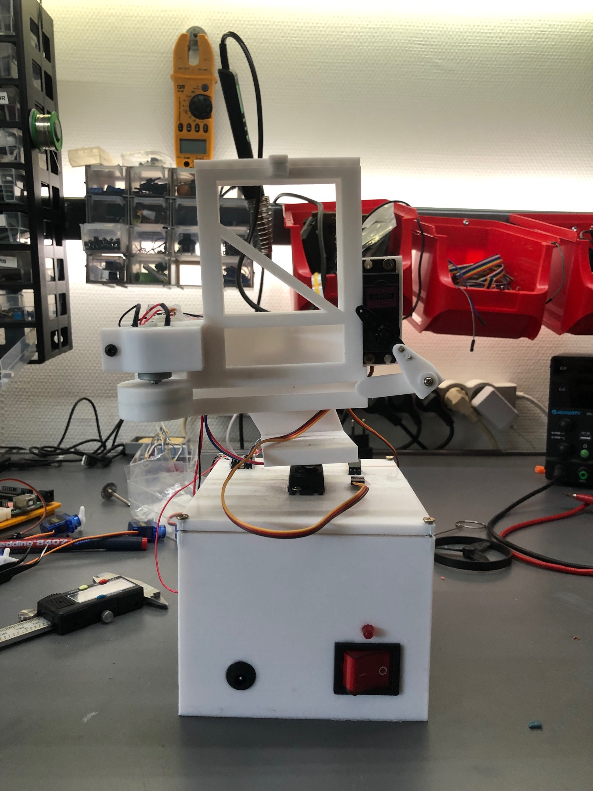
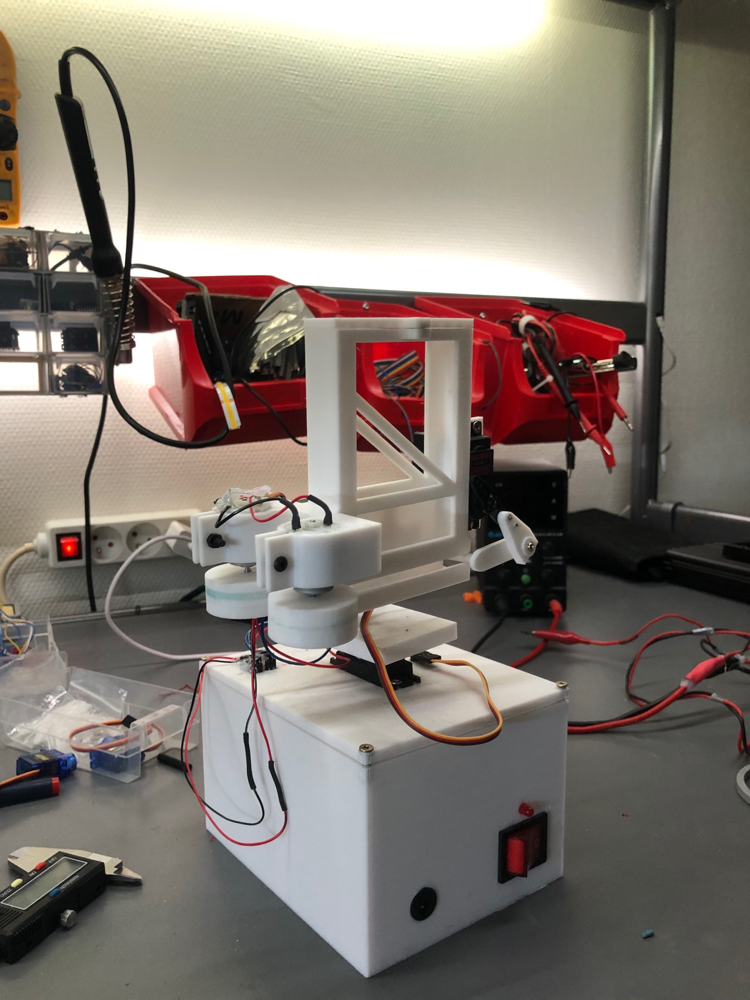
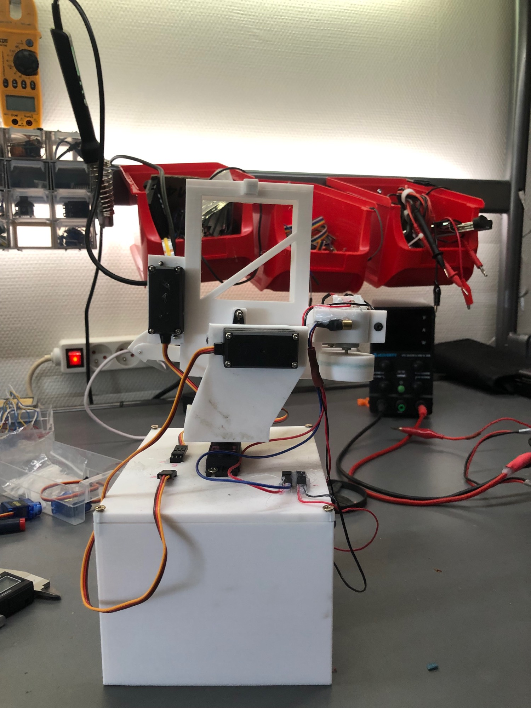
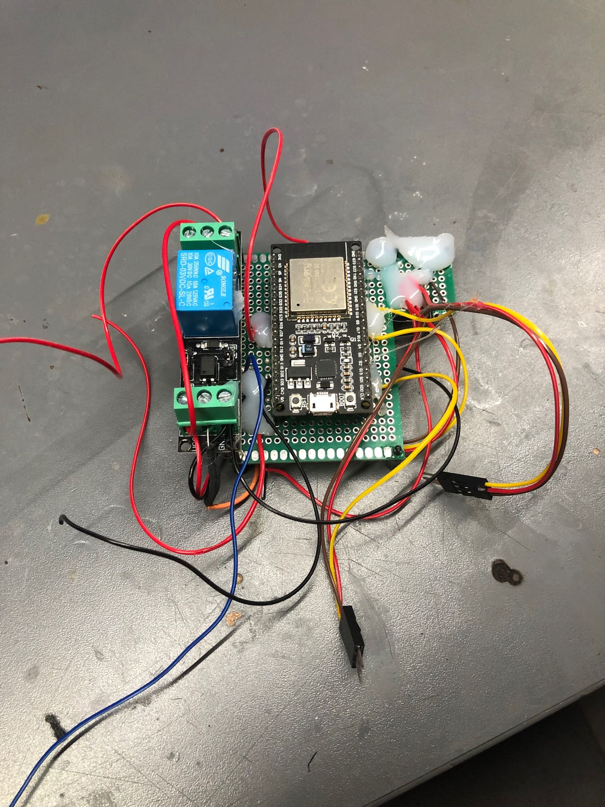
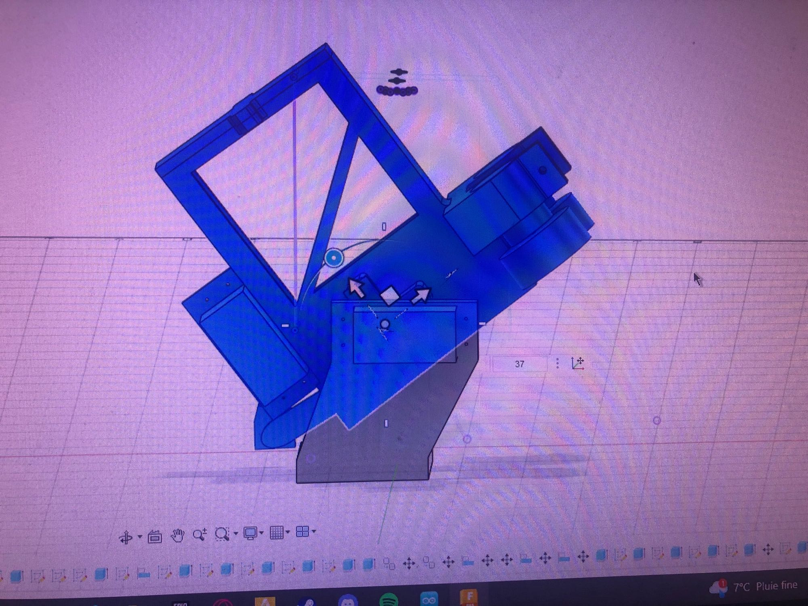
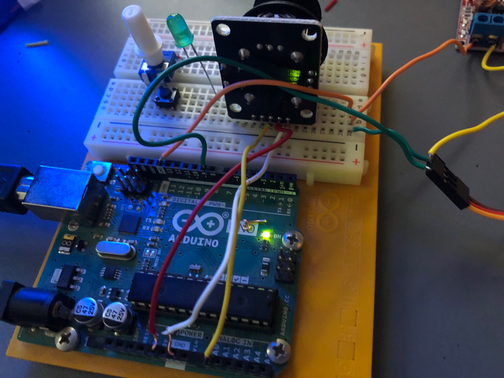
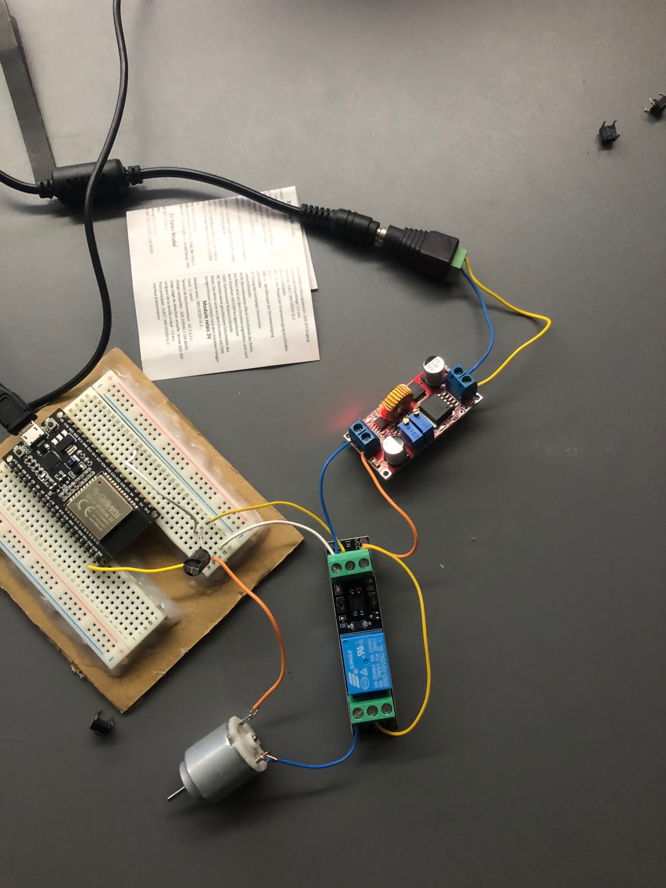
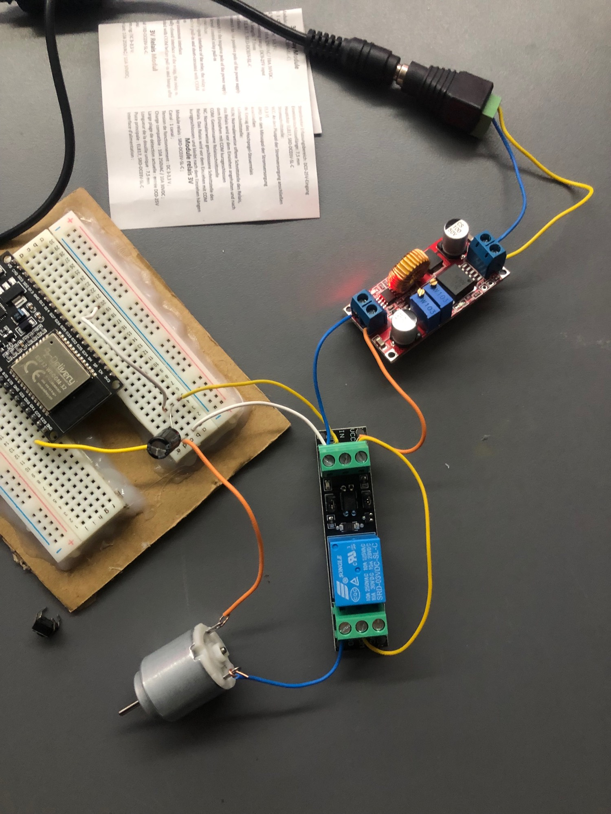

# 🎯 Web-Controlled Nerf Turret

> My very first engineering project — a pan/tilt turret that fires foam Nerf darts, controlled from any phone or laptop through a local web interface. **Where it all started.**

I designed and built this at **14**, right after an internship at CERN that made me fall in love with engineering. It was the first time I ever used CAD software — every part was designed from scratch by me. It's also the project that got me my first 3D printer.

---

## ✨ Features

- **Pan / tilt aiming** via an on-screen joystick, usable from any device on the network
- **Dual-flywheel firing** system with a dedicated feeder servo
- **Single shot** and **rapid-fire (rafale)** modes
- **Laser sight** that can be toggled on/off from the interface
- Fully **self-hosted** — the ESP32 creates its own WiFi access point, no internet required

  
  

---

## 🔧 How it works

The turret runs on an **ESP32** dev board, which hosts its own WiFi access point and serves a web control page directly from flash memory. Commands from the browser are sent to the ESP32 over simple HTTP requests.

**Motion & firing:**
- 3 × servos — one for **pan**, one for **tilt**, and one to **push darts** into the flywheels
- 2 × DC motors (flywheels) that launch the dart, switched through a **relay module**
- A **laser diode** for aiming

**Power:**
- 12 V input via standard banana-jack connectors
- A **buck converter** steps the 12 V down to 5 V for the logic and servos
- A main power switch to arm/disarm the turret

---

## 🎨 Designed from scratch

Every mechanical part was modeled by me in CAD — my very first time using such software. This is the project that pushed me to buy my first 3D printer.

---

## 🧪 From prototype to finished build

Before the final turret, it went through several breadboard prototyping stages — testing the servos, the relay, the motors and the web control one piece at a time.

  
  
  

---

## 🛠️ Built with

`ESP32` · `Arduino / C++` · `HTML / CSS / JS` · `Custom CAD (self-designed parts)` · `FDM 3D printing`

---

## 📜 License

Released under the MIT License — feel free to learn from it or build your own.
